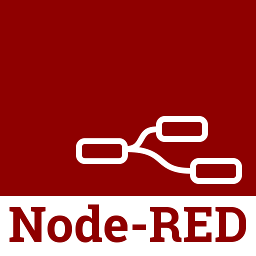

<!-- 

# Hi, I'm Harsh! 👋
 

### I'm an Engineer
 
- 🌱 I’m currently working on Computer Vision, Industrial Linux Embedded systems, and Industrial IoT. 
- 👀 I’m interested in electronics, programming, mathematics, mechanics, and astronomy. 
- 🤖 I’m looking to collaborate on home-automation and robotics. 
- ⚡ Fun fact: I like Pink Floyd. 

### You can view my <a href="https://benahalkar.github.io/" target="_blank" style="color: #ffff00; font-style: italic;">portfolio website</a>.

  

    
### Few software and frameworks I'm proficient in

  

 -->

<!-- Frontend Identifier: START -->

  
# Hi, I'm Harsh! 👋

### I'm an Engineer
- 🌱 I’m currently working on Computer Vision, Industrial Linux Embedded systems, and Industrial IoT.
- 👀 I’m interested in electronics, programming, mathematics, mechanics, and astronomy.
- 🤖 I’m looking to collaborate on home-automation and robotics.
- ⚡ Fun fact: I like Pink Floyd.

<!-- Frontend Identifier: END -->

<!-- Frontend Identifier: LINKS_START -->

  
### You can view my [portfolio website](https://benahalkar.github.io/).

<!-- Frontend Identifier: LINKS_END -->

<!-- Frontend Identifier: SKILLS_START -->

  
### Few software and frameworks I'm proficient in

  
  
  
  
  
  
  
  
  
  
  
  
  
  
  
  
  

<!-- Frontend Identifier: SKILLS_END -->

