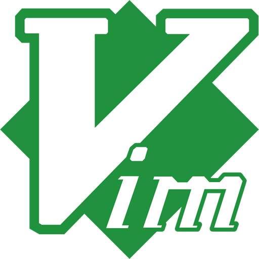

# Hi, I'm Harsh Benahalkar! 👋
 

<!-- ### I'm an Engineer -->
 

Welcome to my little digital corner. Here you can find a decent snapshot of my past and my ongoing journey including my learnings, accomplishments, and everything in between. This portfolio briefly describes me and showcases my projects - a mix of software, hardware, and some with both. You can also find all ways to contact me if you wish to connect. 

Currently, I am an Electrical Engineering master's student from Columbia University, specializing in Distributed Systems, Natural Language Processing, and Machine Learning. My interest in the cloud and Industry 4.0 revolution fuels my passion to learn and contribute. I completed my Bachelors in Electronics and Telecommunications Engineering in 2021. During my undergrad, I contributed extensively to my electric vehicle FSAE team and contributed to the EV revolution. 

In the two interim years, I worked at a startup - building end-to-end solutions for factories to fuel the Industry 3.0 revolution in India.  

Throughout my journey starting from my undergrad, till now - I have worked in various domains, and they have helped me amass a gigantic repository of software and work skills. Skills, that have helped me become one of a kind, and those that have also influenced my work ethics. Every project that I have worked on has taught me something new, and I have always returned the favor by making it impactful. I firmly believe that a project must not only look good, but it must also be reliable and user-friendly.   

When not working, I enjoy cooking, painting, practicing calligraphy, or just exploring the city. Having lived in Mumbai and New York never leaves me without options. 

So welcome, and thanks for stopping by. If you have any feedback, or if you would like to work together, or just chat... you know how to reach out to me.

### You can view my <a href="https://benahalkar.github.io/" target="_blank">portfolio website</a> to read more about me and my projects.

 

    
### Few software and frameworks I'm proficient in

 

<!--  -->

<!--  -->

<!--  -->

<!--  -->

<!--  -->

<!--  -->

